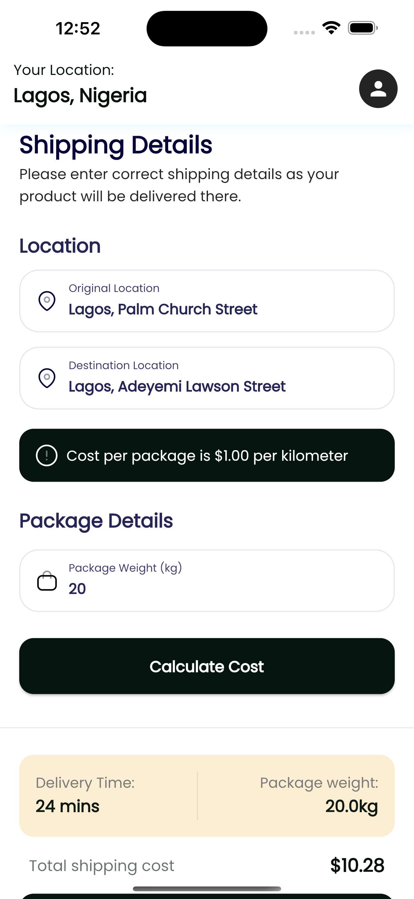

# Shipping App

Shipping app built with the Flutter framework

## Tools used in building

- riverpod `state management`
- flutter_hooks `internal state`
- dio `API calls and networking`
- google_maps_flutter `location`
- geocoding `location`
- shared_preferences `local data storage`
- google_fonts `on demand fonts`
- flutter_svg `svg images`
- flutter `v3.3.10 - mobile sdk`

## App screenshots

